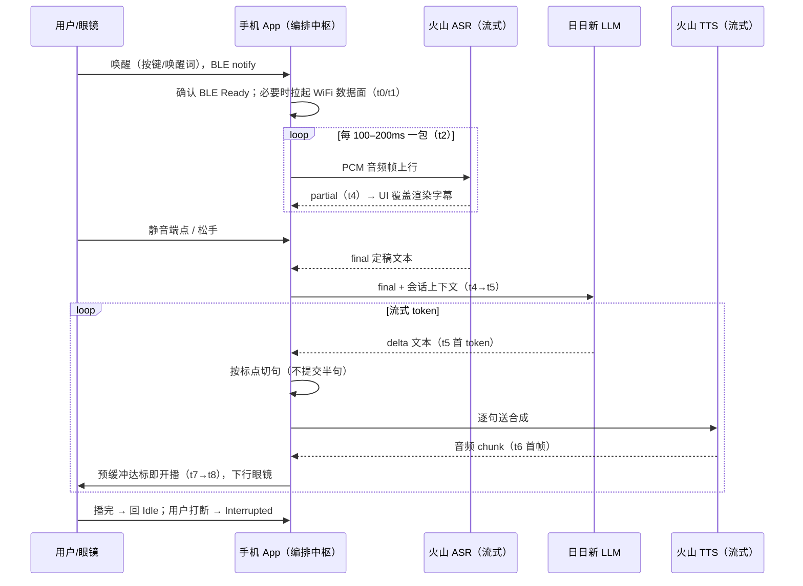
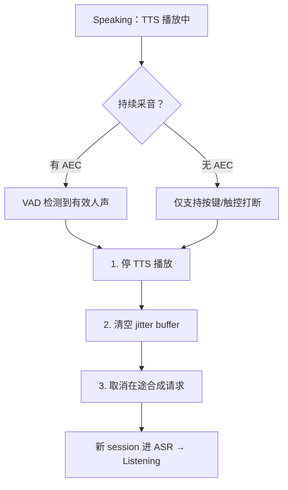
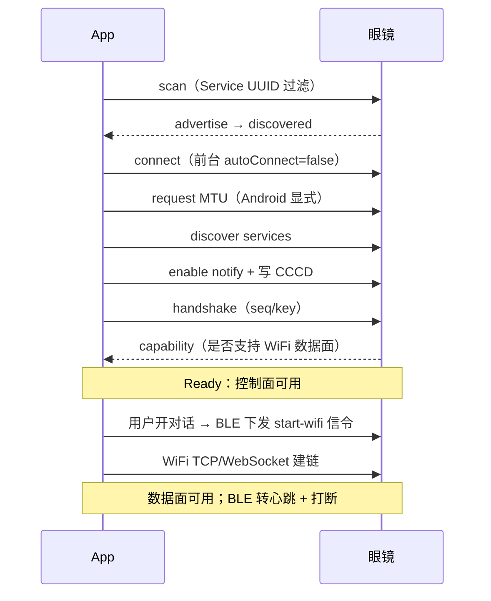

# 08 核心流程与工程细节（含流程图与完整回答）

> 本文把「面试要能讲清楚的核心流程」「工程细节」「项目难点」三块单列，每一项都给出完整回答；流程一律配图。练习目标：图能默画，解说能脱稿。

---

## 一、核心流程（四张图，都要能默画）

### 流程 1：一次完整语音问答（主流程，必背）

逐步解说（面试官挑任何一步深挖，都有话说）：

1. **唤醒**：BLE notify 事件进 App，先检查连接状态机是否 Ready——未 Ready 拒绝开对话。
2. **建数据面**：BLE 下发信令让眼镜开 WiFi，App 建 TCP/WebSocket；WiFi 未就绪禁止大流量入口。
3. **采音上行**：独立采集节奏（不被 UI 卡顿拖住），按 100–200ms 定长分帧，进有界发送队列。
4. **partial/final 分流**：partial 只做 UI 覆盖渲染；**进 LLM 必须等 final**——这是流式 ASR 的第一纪律。
5. **切句送 TTS**：LLM 流式 token 按标点切句，第一句优先；LLM 停在句子中间就等后续 token，不提交半句。
6. **开播策略**：TTS 首帧到不立即播，预缓冲到阈值（200–500ms）才起播，用 underrun 计数调水位。
7. **收尾**：播完回 Idle；任一环节超时/失败 → 降级提示并复位，保证下次可恢复。

**流式的意义（必说）**：不是每段都更快，而是并行流水——ASR 出整句就进 LLM，LLM 出第一句就进 TTS，TTS 出首帧就开播。用户感知的是首句延迟（t8−t0），不是全链路总和。

### 流程 2：会话状态机（状态图）

```mermaid
stateDiagram-v2
    [*] --> Idle
    Idle --> Listening: 用户触发（BLE Ready 校验）
    Listening --> Recognizing: VAD 端点 / 松手
    Recognizing --> Thinking: ASR final
    Recognizing --> Failed: final 看门狗超时
    Thinking --> Speaking: 首句 TTS 可播
    Thinking --> Failed: LLM 超时/错误
    Speaking --> Interrupted: barge-in / 用户停止
    Speaking --> Idle: 播放完成
    Interrupted --> Listening: 三联取消完成
    Failed --> Idle: 降级提示后复位
```

每个边界怎么处置：

| 边界场景 | 处置 |
|----------|------|
| 用户说完但 final 未到 | 看门狗超时才允许用最后一次 partial 兜底，并打点 |
| TTS 播放中用户再说话 | barge-in：三联取消（停播、清 jitter buffer、取消在途合成）→ 新 session 进 ASR |
| BLE 临时断连 | 播放目标丢失：Speaking → Failed，UI 提示；控制面恢复后询问眼镜当前态 |
| 弱网重试 | 每个云请求带 sessionId；迟到回调按 sessionId 丢弃，旧回调不能写进新会话 |
| 来电 / 焦点丢失 | 状态机进 Interrupted/Paused，焦点恢复再决定续播还是放弃 |
| 非法事件 | 每个状态只允许一组合法事件，非法事件打日志丢弃，不做「宽容处理」 |

### 流程 3：打断（barge-in）处理

完整回答：打断的体验分水岭在「停得干净 + 听得清楚」。回声未解决时，播放中采音会把 TTS 采回去造成自问自答，所以短期方案是 Speaking 态暂停采音、牺牲语音打断换稳定（保留按键打断）；产品要求真 barge-in 时，需要固件 AEC 用下行 PCM 作参考信号，App 负责把播放音频时间戳与采音对齐。**这是固件和 App 的协同题，不是单端能吹的。** 见 02-C2。

### 流程 4：BLE 建链与双链路切换

关键决策的回答：

- **为什么双链路**：BLE 带宽扛不住 16k PCM（约 32kB/s），大流量走 WiFi；BLE 低功耗常驻做控制面。
- **为什么打断走 BLE**：WiFi 数据面可能拥塞或正在重连，「停止播放」不能和音频抢同一条堵车的路。
- **WiFi 失败怎么办**：降级到仅文本 / 仅 BLE 控制，明确提示用户；BLE 控制面仍可停播。
- **若加眼镜视频**：码流仍走 WiFi 数据面，play/pause/stop/seek 走 BLE，与 TTS 同构；完整扩展见 `16_眼镜视频播放.md`。

---

## 二、八个工程细节（每条都给完整回答）

### D1 首包延迟（TTFT）怎么拆、怎么降？

**回答**：先拆后降。用 t0–t8 埋点把体感延迟（t8−t0）拆成六段预算，经验上 LLM 首 token 是大头，弱网时 t2→t4（上行到 ASR 首 partial）和 t6→t8（下行到开播）会爆。降的手段：① 流式并行（各段流水不等待）；② 连接复用 + 预建连，不在每次对话做 TLS 握手；③ 切句即合成，第一句出字就送 TTS；④ 播放端预缓冲阈值调小但配 underrun 监控。**没有实测绝对值就不报数字，讲结构和占比。**

### D2 打断处理怎么做？

**回答**：见流程 3。核心是「检测得到 + 停得干净」：检测靠持续采音 + AEC（或按键兜底）；停得干净靠三联取消；回声没解决前用播放态停采的止血方案，并明说这是取舍。

### D3 弱网和重试怎么做？

**回答**：四件事。① **背压**：上行音频用有界队列、丢旧保新，网络恢复后重建 session 不灌过期 PCM；② **重试策略**：ASR 失败重试一次再降级，指数退避封顶，不无限刷；③ **降级路径**：ASR → 文字提示、LLM → 预设话术、TTS → 展示文本，用户永远能看到结果不裸奔；④ **长连接自愈**：心跳探活、半开连接检测、网络切换主动重建（见 02-C7）。

### D4 音频焦点抢占怎么处理？

**回答**：播报前显式申请焦点，成功才开 TTS；监听丢失事件（iOS interruption / Android AUDIOFOCUS_LOSS 与 LOSS_TRANSIENT），丢焦点立即切状态机：暂停取数、暂停采音，区分「永久丢失」（来电）和「瞬时丢失」（导航提示）——瞬时等恢复续播，永久进 Interrupted。不处理的后果是「TTS 还在写 AudioTrack，但系统已把输出切走」，表现为叠音或无声。眼镜场景还要决定：外设出声时手机是否静默。

### D5 蓝牙连接抖动怎么处理？

**回答**：不追求「不断」，追求「断了能恢复、能归因」。① 重连状态机：指数退避 + 抖动，前台有限次，上限后交给用户；② 重连成功必须重新发现服务、重开 Notify，不复用旧对象；③ 断连原因分类（0x08 射频/0x13 对端主动/0x16 本机策略）驱动不同策略；④ RSSI 过差先预警降频，不暴力重连打满射频；⑤ 生产侧导出断连原因 × 机型 × 固件矩阵做归因。

### D6 播放与录音互斥怎么处理？

**回答**：本质是同一套音频硬件上两个方向的资源竞争。处置：状态机层面 Speaking 与 Listening 互斥，切换时先停一头再开另一头；系统层面处理好焦点与 category（iOS）/AudioFocus（Android）；产品层面决定全双工（持续采音 + AEC）还是半双工（播放态停采）。眼镜上还要处理「手机静音、眼镜出声」的音频路由形态。

### D7 帧纪律：音频包为什么不能忽快忽慢？

**回答**：流式协议的前提是客户端按时按量喂数据，服务端 VAD、断句、包等待超时全部建立在连续均匀音频流上。帧间隔抖动的后果：被误判静音提前断句（丢尾字）、触发包等待超时（如 45000081）、端点判断漂移。所以采集放独立线程/固定节奏定时器，发送队列不允许被 UI 阻塞，结束时显式发 final 包而不是等服务端猜。

### D8 连接生命周期：心跳、重连、会话续接

**回答**：WebSocket 连接 ≠ 会话。连接可保活复用（省 TLS 握手），但每次对话新开 session。应用层心跳 10–15s，3 次无 pong 判断断开；断线指数退避重连，重连后重发上下文不丢会话；每次请求带唯一 Request-Id 便于对账；网络切换监听主动重建。这套是长连接系统的通用纪律，WebSocket、推送、BLE 同理。

---

## 三、项目三大难点（完整回答版）

### 难点一：多模块异步协同（状态打架）

**问题**：设备连接、采音、ASR、LLM、TTS、播放同时存在，多个异步状态互相打架——ASR 还没 final 业务就拿 partial 去调 LLM；TTS 还在播又开一路合成，旧音频「复活」；WiFi 断了但 BLE 还在，UI 显示已连接实际对话不可用。

**回答**：三件套。① **显式会话状态机**：每个状态只允许一组合法事件，非法事件打日志丢弃；② **sessionId 隔离**：所有云请求与回调带 sessionId，状态切换取消旧请求，迟到回调直接丢弃；③ **打断三联取消**：停播、清 jitter buffer、取消在途合成。复盘：如果重做，我会把状态机和 Mock 前置，而不是先调通再补治理。

### 难点二：语音链路黑盒（SDK 不透明）

**问题**：火山 SDK 接入很快，但「慢、卡、识别错、自问自答」时 SDK 是黑盒——延迟来自哪里、是采集还是配置、卡顿是网络还是播放，SDK 不会告诉你。

**回答**：把黑盒拆开做可观测。① 六段拆分 + t0–t8 埋点，每段有耗时和错误码；② 三段定界（端侧/网络/云端）+ 定界四连（换输入/换输出/换网络/换客户端），把问题压到一段；③ 端侧的我修，云端的我固化 requestId、时间戳、音频样本推厂商工单；④ App 层永远有降级，服务抖动用户不裸奔。口播：**我没有改过云端引擎，但问题的边界不是黑盒——我负责定界、取证、闭环和降级。**

### 难点三：跨端与原生边界

**问题**：Flutter 写业务快，但蓝牙、音频焦点、前后台、系统权限绕不开原生；什么放 Flutter、什么下沉原生、双端行为怎么一致，是真实的工程决策。

**回答**：边界原则一句话——**生命周期不属于 Widget 的状态，一律放原生**。BLE 断连、音频焦点丢失和 Widget dispose 不同步，所以连接状态机、GATT 队列、AudioFocus、jitter buffer 全在原生；Flutter 只做会话 UI、字幕、设置，通过 EventChannel 收聚合后的状态和文本，PCM 禁止进 Dart。双端一致性靠契约：federated 插件冻结 Dart API，双端同一套测试向量与错误码表；我把 iOS 插件翻译成 Android 时，翻译清单就是 GATT 串行、MTU、CCCD、权限、后台这些行为差异，不是语法转换。

---

## 四、今晚验收

- [ ] 四张图全部默画（主流程、状态机、打断、BLE 建链）
- [ ] 八个工程细节各能讲 60 秒（D1/D3/D4 重点）
- [ ] 三大难点各能讲 2 分钟，口播句脱稿
- [ ] 「流式的意义」一句话脱口而出
